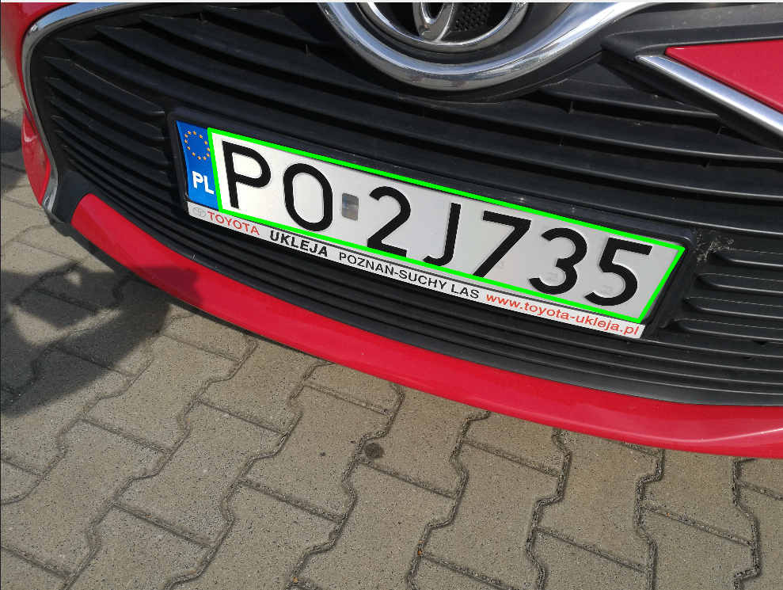
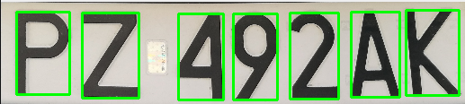
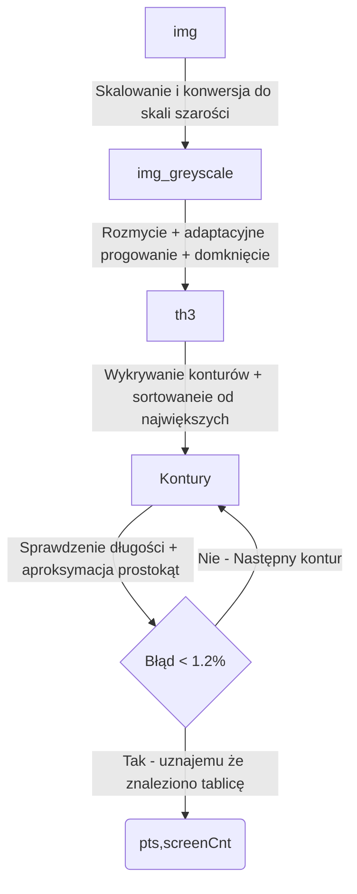
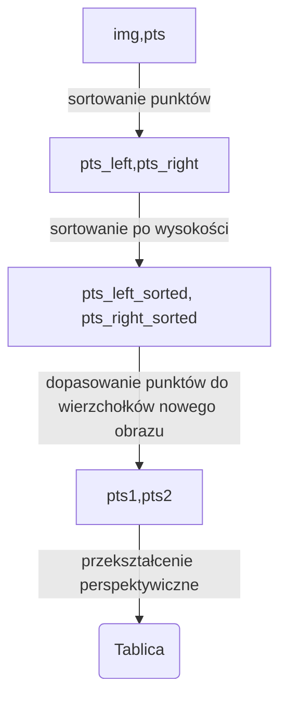
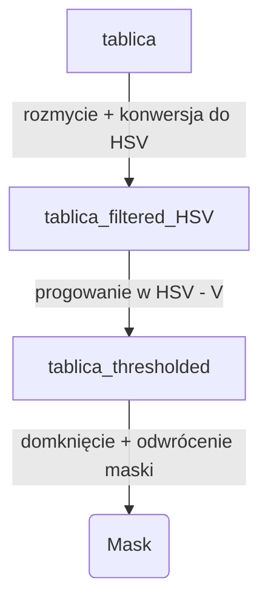
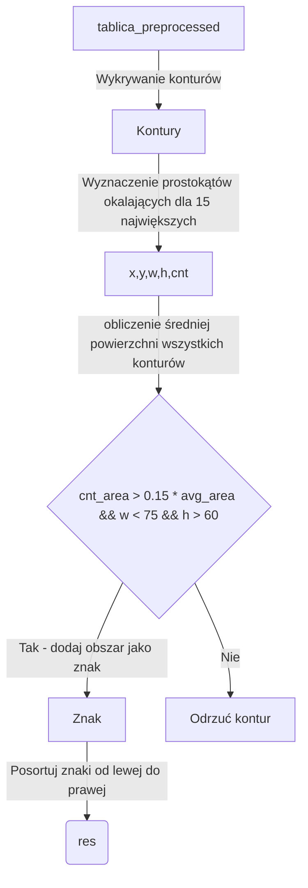

#  Opis Projektu SW - Rozpoznawanie tablic rejestracyjnych

Plik ten zawiera opis działania programu będącego podstawą zaliczenia przedmiotu SW na Politechnice Poznańskiej. Program ten wykrywa oraz rozpoznaje tablice rejestracyjne na zdjęciach bez wykorzystania uczenia maszynowego. Program oparty o bibliotekę [OpenCV](https://opencv.org/).


<p align="center">
  
</p>

## Schemat działania - wykrycie tablicy rejestracyjnej

Program rozpoczyna swoją pracę po przyjęciu dwóch parametrów - ścieżek do pliku wyjściowego oraz folderu zawierającego zdjęcia.
Program odczytuje kolejne zdjęcia na których stara się wykryć położenie tablicy rejestracyjnej. Za to odpowiedzialna jest funckja ```find_license_plate()``` której schemat działania przedstawiono na poniższym diagramie:
<div align="center">


</div>

Funkcja ta zwraca nam współrzędne wierzchołków odnalezionego konturu oraz pozwala na sprawdzenie czy udało się znaleźć jakikolwiek kontur.

## Schemat działania - wyprostowanie znalezionej tablicy

Punkty odnalezione przez funkcję ```find_lincense_plate()``` przekazywane są dalej do funkcji ```get_license_plate()``` która przyjmuje dodatkowo obraz z którego ma wyciąć fragment i dokonać na nim operacji przekształcenia perspektywicznego. Diagram działania znajduje się poniżej:

<div align="center">


</div>

Wynikiem działania tej funkcji jest obraz zawierający wyciętą tablicę rejestracyjną z orginalnego obrazu.

## Schemat działania - przygotowanie wyciętej tablicy
Otrzymana tablica jest ponownie rozmywana tym razem filtrem medianowym o mniejszym rozmiarze. Operacja progowania jest teraz przeprowadzana w HSV po kanale V. Wartości progów dobrane zostały przy pomocy funkcji znajdującej się w pliku **Tuning_functions.py**

<div align="center">


</div>

## Schemat działania - wykrycie i wycięcie znaków

Przygotowana to działań tablica poddawana jest operacji wykrywania konturów, następnie dla każdego konturu wyznaczany jest prostokąt okalający, jego powierzchnia oraz średnia powierzchnia wszystkich konturów. Na tej podstawie oraz informacji o szerokości liter na tablicach rejestracyjnych [Dziennik Ustaw - rok 2022 poz. 1847](https://www.infor.pl/akt-prawny/DZU.2022.245.0001847,metryka,rozporzadzenie-ministra-infrastruktury-w-sprawie-rejestracji-i-oznaczania-pojazdow-wymagan-dla-tablic-rejestracyjnych-oraz-wzorow-innych-dokumentow-zwiazanych-z-rejestracja-pojazdow.html#google_vignette) odrzucane są wybierane kontury
<div align="center">


</div>

## Schemat działania - Rozpoznawanie znaków

Rozpoznawanie znaków jest dokonane najprostszą metodą - dopasowywaniem wzorca. Mając posortowane kolejno znaki program dla wszystkich znaków dopasowuje wzorce zawarte w odpowiednim katalogu. Wzorzec który osiągną największy stopień dopasowania jest traktowany jako wynik predykcji funkcja realizująca to zadanie to ```parse_license_plate()``` która wykonuje ten proces dla całej tablicy i zwraca końcowy łańcuch znaków.
